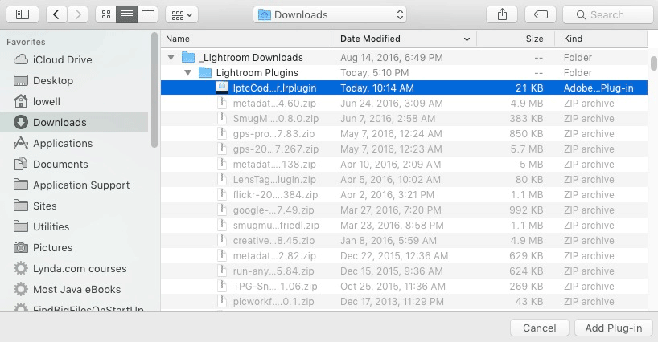
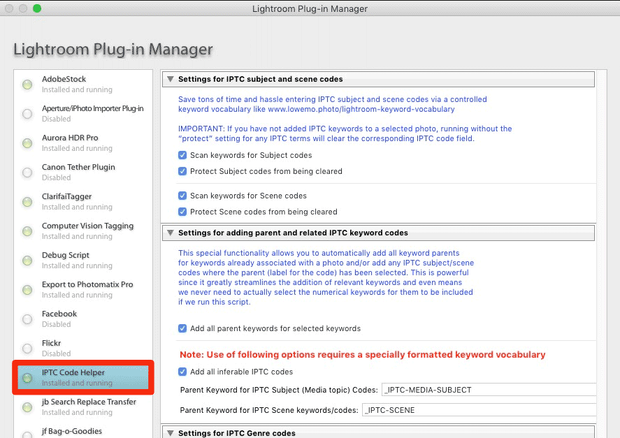
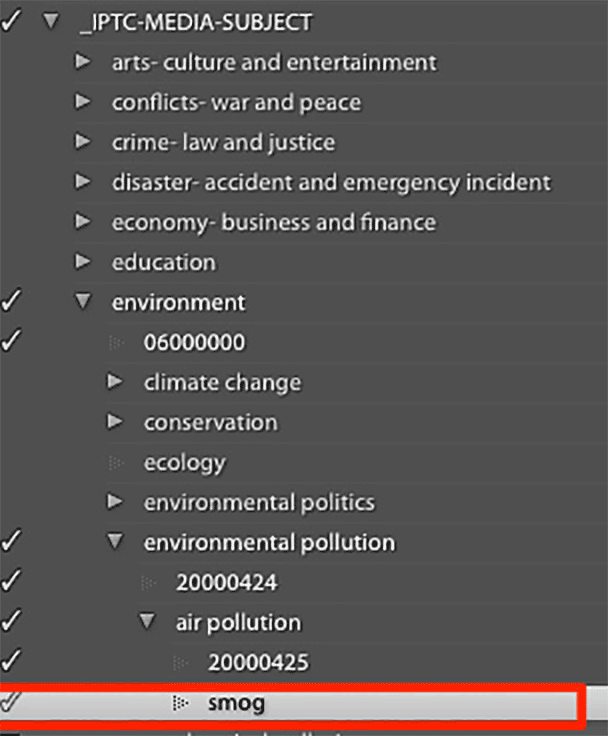

# LrIptcCodeHelper - (Lightroom IPTC Code Helper)
If you enter IPTC subject, scene, and/or genre codes/terms into the provided metadata fields, you know this is a tedious process. There are no handy widgets and shortcuts, like there are for entering keywords. And the “auto-complete” can just mess things up if you try to manually enter codes into, for instance, the IPTC Subject Code(s) field.

The LrIptcCodeHelper is a Lightroom plugin designed to save you a ton of time, frustration, and mind-rotting boredom entering values in Lightroom’s IPTC code fields (subject, scene, and genre currently supported). If you use Lightroom and have no idea what I’m talking about, you probably *don’t* need this. *Most* Lightroom users really don’t need this, nor do they even really need to do much with keywords. But if you are a stock or press photographer or run an agency, these codes are useful for providing image—information in a language-agnostic way; it’s a concept with a lot of promise for internationalization.
## The problem: Entering IPTC terms is tedious
 If you already work with IPTC codes, you may have already struggled to find a good workflow for entering appropriate values into these fields. The scene and subject codes, being just numbers can be especially tricky, and Lightroom’s auto-complete can actually get in your way and make a mess of things if you are trying to manually enter a list of relevant codes into the field.

"My” approach to streamlining the *entry* of the codes (also taken by some other authors of keyword controlled vocabularies) is to put IPTC codes into the keyword hierarchy, along with corresponding human-readable names as the “parent” term (you may still need to consult a print-out to verify you are using a term correctly, but having the terms selectable via the keywording UI makes things much simpler. This approach also allows you to include some of the human-readable terms as standard keywords, as you select the (numerical) subject and scene codes. My LoweMo.photo controlled keyword vocabulary also includes the IPTC Genre codes (sections for both “Intellectual Genre” and “Product Genre"). I think that the “Product Genre” terms, though not given a standard field by Adobe, are more appropriate for describing most photographic media. Maybe it was a mistake that the “Genre” field is labeled “Intellectual Genre"; those terms seem more appropriate for describing text articles or other “stories” than image media.

## The LrIptcCodeHelper Lightroom plugin copies IPTC “keywords” to the IPTC fields
Since the IPTC subject (or media topic) codes and scene codes are numerical, these float to the top of the alphabetically-sorted “Keyword tags” field. Then it’s not hard to select and copy the subject and scene codes, but the IPTC metadata fields are far below in the Lightroom metadata interface, under the EXIF fields. You will probably need to scroll up and down in Lightroom’s metadata side panel to move between the keyword and IPTC code fields. I had already used [John Beardsworth’s excellent Search/Replace Transfer plugin](http://www.beardsworth.co.uk/lightroom/search-and-replace/ "Search Replace Transfer &#8211; John Beardsworth") to help with the copy/paste process, but that plugin is not really designed for the task (it copies all the contents of a field to another field, but does not provide a method to copy *some* of the keywords to one field and *some* to another). The LrIptcCodeHelper plugin was actually created after some discussion of my use case with Mr Beardsworth, who gave me some initial tips and Lightroom SDK example code (a couple Lua scripts) to help get me started. (Thank you, John… it really *was* helpful!)

### IPTC Subject codes (and compatible “media topic” codes) are 8-digit numerical codes
Currently this plugin only identifies a subject code by the fact that it’s a numerical “keyword", 8 characters long. If your workflow uses 8-digit codes for *any other* purpose, you may need to take an alternate route. But for most of us, 8-digit numerical “keywords” will only be IPTC subject codes (or “media topic” codes, which are the IPTC’s updated form of the subject codes and are actually the terms included in my keyword list). If you use my keyword list, these terms are not exported with the keywords (although the human-readable “parent” terms normally will be, along with any possible synonyms—and a recent development is that all parent terms, human-readable and corresponding media codes, will be automatically selected, so you can add specific terms, like 

### IPTC Scene codes are 6-digit numerical codes
As with subject codes, this plugin only identifies a scene code by the fact that it’s a numerical “keyword", 6 characters long. If your workflow uses 6-digit codes for *any other* purpose, you may need to make some changes to how the code runs. For the “rest of us", differentiating scene/subject codes from other 6- or 8-digit terms would significantly slow down the performance of this plugin.

### IPTC Genre codes are human-readable terms
All of the IPTC “Genre” terms are human-readable/English words, which implies a few things:

:point_right: In many cases, these terms *may* also be useful “keywords” to add to an image

:point_right: *Names* of these keywords may be the same as some already in your keyword vocabulary hierarchy

:point_right: It’s possible that the *context* is *not* the same. For example the term “Background", in the context of IPTC “Intellectual Genre” is described as providing “… some scene setting and explanation for the event being reported."

I took this all into consideration when designing my keyword vocabulary and this plugin, so…:

:point_right: In some cases, where I think that a term is just too unlikely to be useful as an image keyword, I’ve set the keyword not to be exported. This is especially the case with many of the “Intellectual Genre” keywords. Others will be exported. You can make changes to which keywords are exported if my judgment on the matter does not match your own.

:point_right: If the shoe fits, wear it. (e.g. "Weather" is both a Subject (Media topic) term *and* a Genre term). If it is present for "subject", we may insert it as Genre, too.

:point_right: We avoid exporting genre “keywords” if the context is unusual (in the scope of describing a photograph)

I’ll briefly clarify: It may *not* be helpful to have keywords like “Daybook” added to a photo that is not an image of an actual day planner/agenda; if you wouldn’t use the term to describe any photo in your collection, make sure it’s not set to be exported. It would take significant extra processing time to verify that each actual keyword for an image with a name that matches a “genre code” actually *is* a genre code. I won’t go into great detail here, but this is a potential area for further experimentation and improvement.

#### IPTC Genre Flavors: “Intellectual Genre” or “Product Genre”
The IPTC “Intellectual Genre” field that Adobe decided to use seems less appropriate for most stock photography. The IPTC “Product Genre” is more likely to have relevant terms for tagging photographic media, so it is included in the LoweMo keyword vocabulary and is supported here. For now, rather than adding a new custom field, any “Product Genre” terms are combined with any “intellectual” genre terms and both are put in the IPTC Genre field.

## Installing the IPTC Code Helper Lightroom plugin
Installing and using this plugin is the same as for any other Lightroom plugin, so you may already know what to do, but I will still outline the installation process:

### Adding a plugin via the Plugin Manager
If you add a new plugin to the right directory in Mac or Windows, Lightroom should recognize the new plugin and it will already be installed and ready for use.

:point_right: On a Mac, that’s the `~/Library/Application Support/Adobe/Lightroom/Modules` directory.

:point_right: On Windows, it should be `C:\Users\your-username\AppData\Roaming\Adobe\Lightroom\Modules`.

It’s possible that the `Modules` directory does not already exist. If so, you can create it.

You can also use the Plugin Manager to install Lightroom plugins from *anywhere* you might have saved them, via the following steps:

1. Start Lightroom
2. Open `File > Plug-in Manager…`

3. Click on the `Add` button

4. Locate the plugin, wherever you have downloaded it (here in a sub-folder within my Downloads directory)

5. You should now see that the plugin is “installed and running”

## Configuring the IPTC Code Helper for your optimal use
For now, settings for this plugin are only visible in the Plugin Manager; read on…

### Safety first (avoiding loss of existing data)
It’s likely that, if you’ve been doing this for a while, you have *already* added IPTC codes for some of your image library. In that case, be sure that you run with the (default) setting for the plugin to “Prevent clearing existing” values from the IPTC fields for those images. Otherwise, if you select images with values in the IPTC fields, but no corresponding keywords selected, you may clear those fields. **This could result in a lot of work lost, so please beware.**

Please also note that it’s “all or nothing”, if you decide to use this plugin to update values for a field. At this time, values already in the field will be overwritten by whatever corresponding IPTC keywords you have selected. In the case of Genre codes, which may match an existing keyword (outside of the IPTC Genre parent hierarchies), it is *possible* that this *could* happen accidentally. Therefore, the initial default setting for the “Operate on IPTC … Genre keywords” settings is “off".

### Other Settings in the Lightroom Plugin Manager
Each of the IPTC controlled vocabulary fields has separate checkboxes for:
1. setting whether to operate on that IPTC vocabulary, and
2. setting whether to protect any existing field value from being cleared (if no corresponding keywords are selected)

For users of the LoweMo Lightroom Keyword CV, the top-level IPTC “parent terms” are already entered into the corresponding fields, but providing this configuration allows anyone not using the keyword vocabulary I developed (or anyone who may have renamed those top-level category keywords) to make full use of the plugin. Note that such top-level terms MUST be uniquely named within your keyword vocabulary.

#### Genre Settings and Our Approach
In the case of the “Genre” vocabularies, this is a bit different. Our current approach is to put both Intellectual and Product Genre keywords into the one (“Intellectual Genre”) field since the Product Genre field does not exist and, for most of us, has terms that are more appropriate for description of images. The “Intellectual Genre” keywords are generally less relevant to photo media. (For example, a photo of someone *might* be useful in an obituary *at some point*, but should we *really* be adding *that* tag for “the day when…”?) Other “Intellectual Genre” term clearly are not used in the way that we normally describe photographic media, e.g. "Background", one of the terms, has nothing to do with an image you might use as the bottom layer of a composition and could be better called "back-story", i.e. the use description for it on the IPTC newscodes site is "The object provides some scene setting and explanation for the event being reported." So it's all about reportage.

## Using the IPTC Code Helper Lightroom Plugin
Once the plugin is configured, it’s simply a matter of selecting some photos and running the plugin processes on them by selecting the menu item, `File > Plugin Extras > Run IPTC Code Helper`:

If you have a relatively small number of images selected, and if you are not running more “expensive” processes, such as the automatic adding of keyword parents and related IPTC Subject/Media and/or Scene codes, the processing may be done in under a second:

Imagine that! The only time it takes, once you have done normal keywording, including a few extra terms, is basically the time it takes to select the photos and trigger the script. Before I’d written this script (but after I’d started using the keyword list to add subject and scene codes), it was taking me about a minute per photo to copy, find the fields, paste, and clean things up; not only was it just too much time spent on this process, but it was also the kind of task that made me want to run away and find any other drudge-work that needed to be done AND it was the kind of task that could lead to lots of small mistakes (copying a character too few or too many or pasting the codes into a wrong field… one could not multi-task and expect a perfect job). Now that work, plus all the Genre codes, which appear all over within the keyword list, is just finished in no time flat. I hope that at least a few of you will find this plugin and love it as much as I do!

### New and Improved
I just made passing reference to the fact that *some* functionality may not be that fast if you are running a large batch. The super-fast functionality is possible if all codes are already in the keyword field, but the new features allow you to add just a few codes and let this plugin find others that *should* be selected. Let's look at an example screenshot to help illustrate what is going on:

While working to help improve some open-source plugins, ones which access Web-based "visual keywording" technologies, my first goal was to make these plugins respect a hierarchical vocabulary and not just re-create already-existing terms at the base level (or under a designated parent for "new keywords"). I was getting loads of duplicate terms and the time it took to sort out merging of those terms took so long that it just didn't make any sense to use the plugins. But then I got them to find the existing keywords within the hierarchy. My specially-developed vocabulary, in order to avoid too much duplication of terms, has some extra human-readable keywords (with no corresponding IPTC Subject/Mediat topic codes) inserted into appropriate sections of that hierarchy. So even though "smog" is not actually a term in the IPTC Subject (or Media Topic) vocabulary, it fits nicely as a sub-category of "air pollution", which where I put that term in my organization. Now if an auto-tagging robot adds the term "smog" and I agree, it's no longer a matter of searching in my filter to find "smog" and then adding all the keywords visible above it (in the hierarchy), then removing the keyword filter to the various other child/sibling terms which include the IPTC Subject Codes. Instead, if I select "smog" and have properly configured this plugin, it can “automagically” find all the parent terms that you see selected here, as well as the relevant numerical Subject codes.
